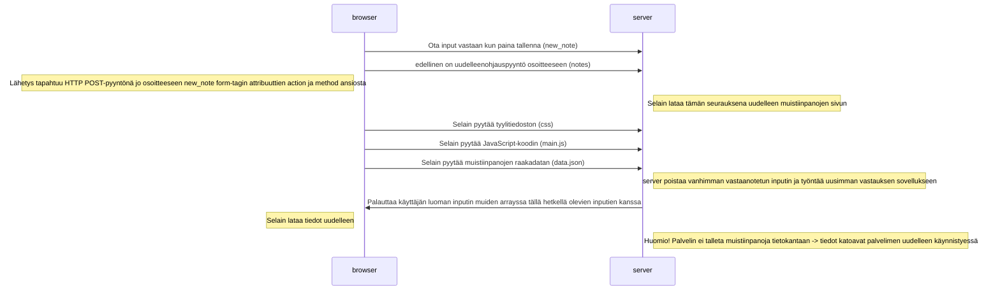

```mermaid
sequenceDiagram
	participant browser
	participant server
	
	browser->>server: Ota input vastaan kun paina tallenna (new_note)
	browser->>server: edellinen on uudelleenohjauspyyntö osoitteeseen (notes)
	Note left of browser: Lähetys tapahtuu HTTP POST-pyyntönä jo osoitteeseen new_note form-tagin attribuuttien action ja method ansiosta
	Note right of server: Selain lataa tämän seurauksena uudelleen muistiinpanojen sivun
	browser->>server: Selain pyytää tyylitiedoston (css)
	browser->>server: Selain pyytää JavaScript-koodin (main.js)
	browser->>server: Selain pyytää muistiinpanojen raakadatan (data.json)
	Note right of server: server poistaa vanhimman vastaanotetun inputin ja työntää uusimman vastauksen sovellukseen
	server->>browser: Palauttaa käyttäjän luoman inputin muiden arrayssa tällä hetkellä olevien inputien kanssa
	Note left of browser: Selain lataa tiedot uudelleen
	Note right of server: Huomio! Palvelin ei talleta muistiinpanoja tietokantaan -> tiedot katoavat palvelimen uudelleen käynnistyessä
```